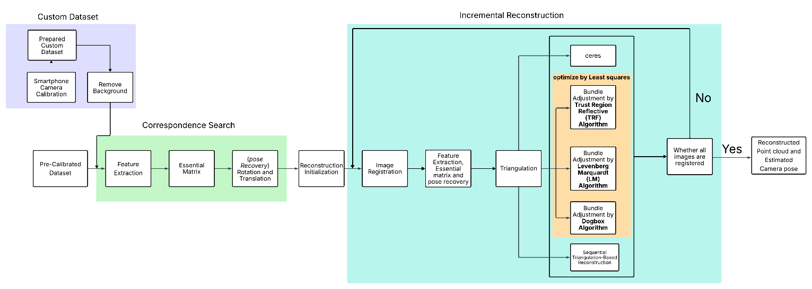
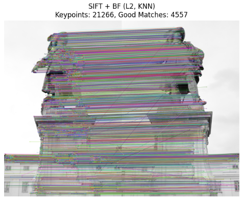
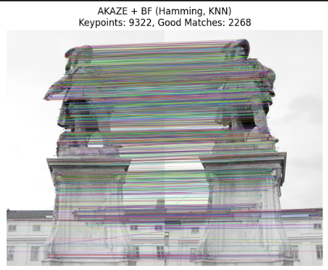
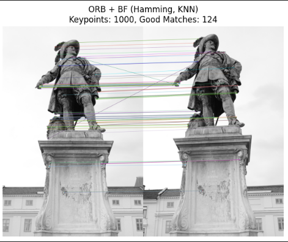
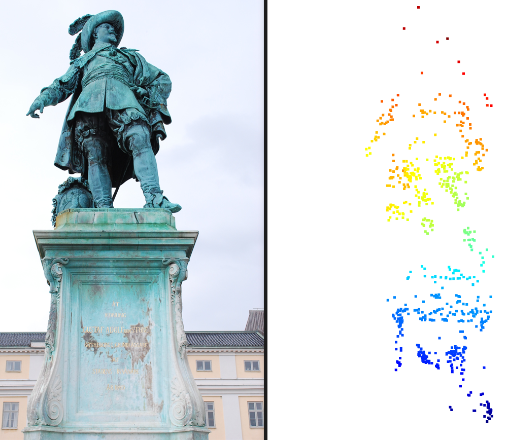
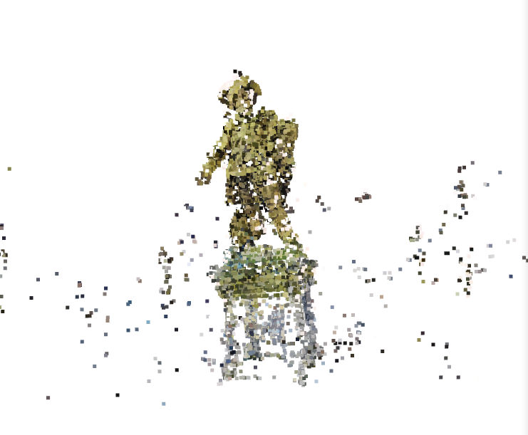

# Structure from Motion (SfM)
> *"A single image may capture a moment—but many together can reconstruct a world."*

Whether you're capturing a statue, surveying a landscape, or reimagining historical ruins, SfM is the bridge between snapshots and spatial understanding. This document is your guide through that journey—from raw images to precise reconstructions—explained with code, mathematics, and visual results.

---
## 1. Introduction

Structure from Motion (SfM) is a computer vision and photogrammetry technique that reconstructs the 3D structure of a scene and determines camera poses from a collection of 2D images. By identifying common features and solving mathematical equations, it transforms a set of images into a cohesive 3D representation, applicable in fields like 3D modeling, augmented reality, and historical landscape reconstruction. [Read more here](https://medium.com/@sepideh.92sh/unveiling-the-magic-of-3d-reconstruction-a-journey-through-structure-from-motion-sfm-in-c-d66bc1d01a96).

## SFM Pipeline Overview

The flowchart shows the SfM pipeline we followed. In the final step, only one method was used at a time for reconstruction:

- Ceres Solver  
- Bundle Adjustment (TRF, LM, Dogbox)  
- Sequential Triangulation-based Reconstruction
<br>
## Datasets

In this project, we first implemented all the steps of Structure-from-Motion (SfM) on a pre-calibrated dataset, and later extended the pipeline to work with our own custom dataset, which involved camera calibration and careful data collection.

### Pre-Calibrated Dataset

The dataset includes 55 high-resolution images of the Gustav II Adolf statue. We also experimented with other datasets available through the provided [link](https://www.maths.lth.se/matematiklth/personal/calle/dataset/dataset.html).

## Feature Detection and Matching

In our SfM pipeline, we evaluated three feature detection and matching combinations:

- SIFT with BFMatcher (L2-norm, KNN)  
- AKAZE with Hamming distance  
- ORB with Hamming distance  

These choices were guided by best practices from OpenCV and a research paper: [A Blender plug-in for comparing Structure from Motion pipelines](https://www.researchgate.net/publication/329751459_A_Blender_plug-in_for_comparing_Structure_from_Motion_pipelines).

|   |  |  | 

## Feature Matching Results

Based on the results, **SIFT combined with BFMatcher and KNN** yielded the most reliable feature correspondences, making it the preferred choice for our pipeline.

## Mathematical Explanation with Reference

### Initial Reconstruction

#### 1) Camera Pose Initialization
We fix the first camera as the origin using an identity pose:
$$
P_0 = K \cdot [I \mid 0]
$$

This serves as the reference frame for triangulation. Arrays for camera poses and 3D points are also initialized.

#### 2) Feature Detection and Matching

The first two images are loaded and downscaled. Features are extracted and matched using the `features_extraction()` function, which internally uses **SIFT + BFMatcher + KNN** to return store filtered features.

#### 3) Essential Matrix Estimation

We compute the **Essential Matrix** using:

```python
cv2.findEssentialMat()
```
#### Fundamental Matrix (Optional)

Although we skip explicit computation of the **Fundamental Matrix**, it can be obtained using the relation between the **Essential Matrix** and the **camera intrinsic matrix**:

$$
F = K^{-T} \cdot E \cdot K^{-1}
$$

Where:
- \( E \) is the Essential Matrix  
- \( K \) is the camera intrinsic matrix

We validate \( E \) by ensuring it has **rank 2** and \( \det(E) = 0 \).

---

## 4) Pose Recovery

We use `cv2.recoverPose()` to extract **rotation \( R \)** and **translation \( t \)** from the Essential Matrix \( E \). This function:
- Performs **Singular Value Decomposition (SVD)**
- Applies a **chirality check** to ensure triangulated 3D points lie in front of both cameras

---

## 5) Second Camera Pose Computation

The second camera’s pose is computed relative to the first by applying the recovered \( R \) and \( t \).  
The final **3×4 projection matrix** is computed as:

$$
P = K \cdot [R \mid t]
$$

Where \( K \) is the intrinsic matrix.

---

## 6) Triangulation

We use `cv2.triangulatePoints()` to reconstruct 3D points from the first and second camera projections along with their matching feature points.  
The output is in **homogeneous coordinates**, which we convert to **Euclidean** coordinates.
<br>

---

## Incremental Camera Registration (PnP)

After recovering the initial pose, we incrementally add new images by matching features with the previous frame.  
We estimate each new camera pose using:

```python
cv2.solvePnPRansac()
```

This solves the **Perspective-n-Point (PnP)** problem using RANSAC, robust to outliers, and optimizes via the **Levenberg-Marquardt algorithm** to minimize reprojection error.

The `solve_pnp_prob()` function encapsulates this process and returns the camera's **rotation** and **translation**.

---

## Rotation Vector to Matrix Conversion

After pose estimation, the **rotation vector** is converted to a rotation matrix using:

```python
cv2.Rodrigues()
```

Only **inlier correspondences** are retained for accurate triangulation and further optimization.

---

## Post-Pose Estimation: Triangulation and Optimization

After estimating each camera pose:
1. New 3D points are triangulated
2. Reprojection error is calculated
3. **Bundle Adjustment** is applied to refine:
   - Camera poses  
   - 3D point positions

---

## Sequential Triangulation-Based Reconstruction

Images are added incrementally. For each new frame, the following steps are executed:
- Establish feature correspondences  
- Estimate pose using `solvePnPRansac`  
- Triangulate 3D points  
- Compute reprojection error for validation

Applied to the **Gustav II Adolf statue** dataset, this method resulted in:
- A **dense 3D point cloud** with **16,367 points**
- Processing time for **55 images: 44 seconds**
- However, high reprojection error indicated the need for further optimization
<table>
  <tr>
    <td></td>
    <td></td>
  </tr>
</table>
**Bundle Adjustment** was applied to refine both camera parameters and the structure, significantly improving reconstruction accuracy.

## 2. Global Optimization via Bundle Adjustment

After initial 3D reconstruction, reprojection errors can be high.  
To refine both **3D points** and **camera parameters**, we apply **Bundle Adjustment (BA)**—a nonlinear least-squares optimization that minimizes reprojection error across all views.

### Mathematical Formulation

Minimize the sum of Euclidean distances between observed 2D points \( x_{ij} \) and their predicted projections \( Q(a_j, b_i) \), across all visible points \( v_{ij} = 1 \):

$$
\min_{a_j, b_i} \sum_{i,j} v_{ij} \cdot \| x_{ij} - Q(a_j, b_i) \|^2
$$

Where:
- \( x_{ij} \): observed 2D point
- \( Q(a_j, b_i) \): projected 2D point from 3D point \( b_i \) and camera parameters \( a_j \)
- \( v_{ij} \): visibility flag (1 if visible)

---

### Our Implementation

We implemented **Bundle Adjustment** using `SciPy`’s `least_squares` function with three solvers:

- **Trust Region Reflective (TRF)**
- **Dogbox**
- **Levenberg-Marquardt (LM)**

---

### TRF-Based Bundle Adjustment

The **TRF solver** optimizes within a dynamic trust region, making it robust for large, sparse problems.

We used the following parameters:

```python
variables
method='trf'
loss='huber'        # Robust to outliers like Linear, 
f_scale=1.0
ftol=1e-6
xtol=1e-6
gtol=err_thresh
max_nfev=200
```

Using a basic **Linear loss**, the optimization achieved significantly lower reprojection error than sequential reconstruction.

- **Processing time** for 55 images: **~4 minutes 46 seconds**


<table>
  <thead>
    <tr>
      <th>Loss Function Name</th>
      <th>Reprojection Error Image</th>
      <th>Point Cloud Image</th>
      <th>Total Points</th>
      <th>Time Taken</th>
    </tr>
  </thead>
  <tbody>
    <tr>
      <td>Linear</td>
      <td></td>
      <td></td>
      <td>16619</td>
      <td>00:04:46</td>
    </tr>
    <tr>
      <td>Huber</td>
      <td></td>
      <td></td>
           <td>15419</td>
<td>00:02:24</td>
    </tr>
    <tr>
      <td>Soft L1</td>
      <td></td>
      <td></td>
      <td>15419</td>
      <td>00:02:20</td>
    </tr>
   <tr>
    <td>Cauchy <br/><small><em>(also used in Ceres Solver)</em></small></td>
    <td></td>
    <td></td>
    <td>17626</td>
    <td>00:03:05</td>
   </tr>

  </tbody>
</table>

